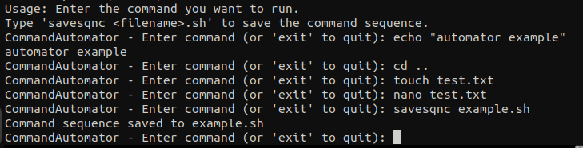
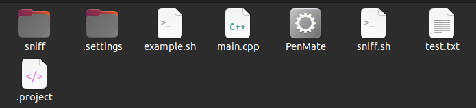
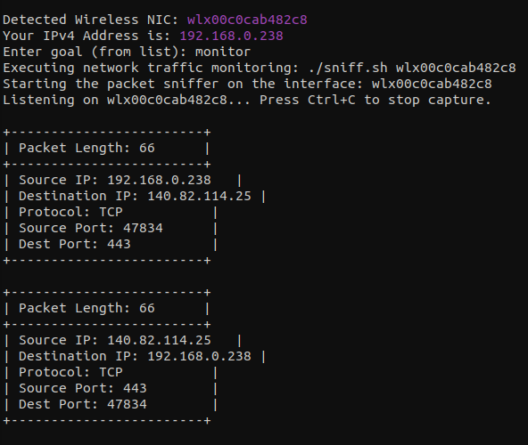
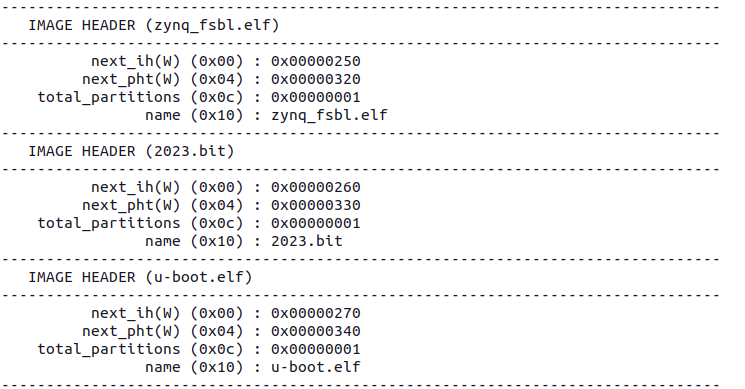

# PenMate

Toolset has its own sections of tools to perform specific actions. Here you can find all information about the toolset and what does it include. It has been developed to support my own work while performing penetration tests on virtual machines. It relies on already existing tools and includes custom implementations of some functionalities. The project is being supported as it is developed and integrated with the latest penetration testing tools over the next 2 years. It is intended to support repetitive processes that take too long to execute manually. Chceck launch variants with <code>penmate -h</code>. A detailed description of each section and what tools they use is below:

<h3>CommandAutomator ⚙️</h3>

Command automation tool is a function which records all commands terminated in linux bash terminal and converts them into bash file. When a sequence is fed into the program, all commands execute simultaneously in real time. It allows creating a script and adapt it to specific cases. It is possible to interact with other pentesting applications, as they also interact with the user thanks to bash.

To save your sequence type: <code>savesqnc example.sh</code> as input, where 'example' is your script name.

The output file <code>example.sh</code> and <code>test.txt</code>(created by touch command) are stored in desired directory.

<h3>NetworkRipper 🔪˒﹚)</h3>

This automation kit is based on the use of the following tools:

<ol>
  <li><a href="https://www.scapy.net">Scapy</a></li>
  <li><a href="https://github.com/derv82/wifite?tab=readme-ov-file">Wifite</a></li>
  <li><a href="https://github.com/csshark/sdr-cap/tree/main">Custom Sniffer Light Driver (modified driver from SDR-CAP project)</a></li>
  <li><a href="https://nmap.org/">Nmap</a></li>
  <li><a href="https://www.bettercap.org/">Bettercap</a></li>
  <li>Custom Signal Spectrum Capture Tool</li>
  <li>Custom CVE Scanner</li>
</ol>

AI agent-like interaction has been introduced. Your input does not have to be identical to the one displayed in the list of supported commands. NetworkRipper is the biggest module of all from PenMate and has a lot of feautures, in case it is hard to develop new original solution, tool automates some of the most common tedious processes executed manually and provides customization of running the comamnds. By veryfing user parameters tools adapts to them by recommending and executing best scripts configuration possible.

With NetworkRipper penetration testers have to enter the goal and the application gives possible solutions based on keywords (for more complex tasks, give as many keywords as possible). All executed commands are displayed, so user has whole access to what has been executed. CVE scanner works only for local software/services <b>it won't</b> rely on your open ports and website to found injection attacks possibilities - that is why penetration testers exist. Many custom C drivers and solutions has been introduced and are distributed as open-source.
 

Example usage:

<h3>WebExposer 🌐👾</h3>

Module dedicated to web penetration testing. It checks for common vulnerabilities such as XSS, SQL injection attacks, POST/GET manipulation. It is supported by Python program that finds endpoints and performs fuzzing with some well-known payloads. Another WAP Tools are recommended, user should not rely on webExposer only. AI web agent is going to be introduced in version 2.0. Recommended Tools to use with this module: <a href="https://caido.io/">CAIDO</a>. API endpoints + payload scanner relies on wordlists which user can choose from those included in the toolset or use his own. Included wordlists: api-fuzzing.txt (588 paths), commonpaths.txt(over 10 000 paths).

<h3>IoT Sentinel 🔒🕊️</h3>

Verify your connection security with IoT devices via scanning for anomalies in msqtt protocol config (disabled encryption/redirection/authentication or authorization breakdowns and topic security). There was also a tool for direct hardware verification - the .bin file scanner recognizes the type of firmware (if not specified) and looks for values that may have been modified, verifies hashes and simulates the restoration of the (partially) components of the file. It is "first layer tool" in case of suspicious behavior of IoT devices. RTOS/Linux/Realtek and some of the popular firmware is recognized in this module. Also can be used to verify firmware embedded systems from trusted vendors (e.g. Analog Devices/Avnet). This module allows the user to perform a diagnosis of the connection of a given IoT device.

##### Example .bin file structure and component files.

Remember to give the scanner proper permissions to read firmware files (they are usually restricted).

<h3>Quick navigation tips:</h3>

Returning to previous selection: Ctrl + C shortcut.

Exiting application: Ctrl + Z shortcut.

NetworkRipper: Changing wireless network interface mode: <code>nicmode monitor</code>/<code>managed</code>

Localhost security state: <code>state</code>

Displaying logo: <code>logo</code> command.

<h2>Installation:</h2>

It is amateur tool to refresh some programming in Python and C++ so it requires manual compilation via g++:

<code>g++ -o PenMate main.cpp obtainipaddr.cpp firmwareVerifier.cpp -lcurl -lmosquitto -lssl -lcrypto</code>

There are also flags for launching tool help like in debian package, but I was too lazy to fix all the paths to .deb structure. I am penetration tester, not a sw developer.

<h2>License</h2>

This project is licensed under the GPLv2 License in accordance with licensed open-source tools icnluded in product. See the <a href="LICENSE">LICENSE</a> file for details.

